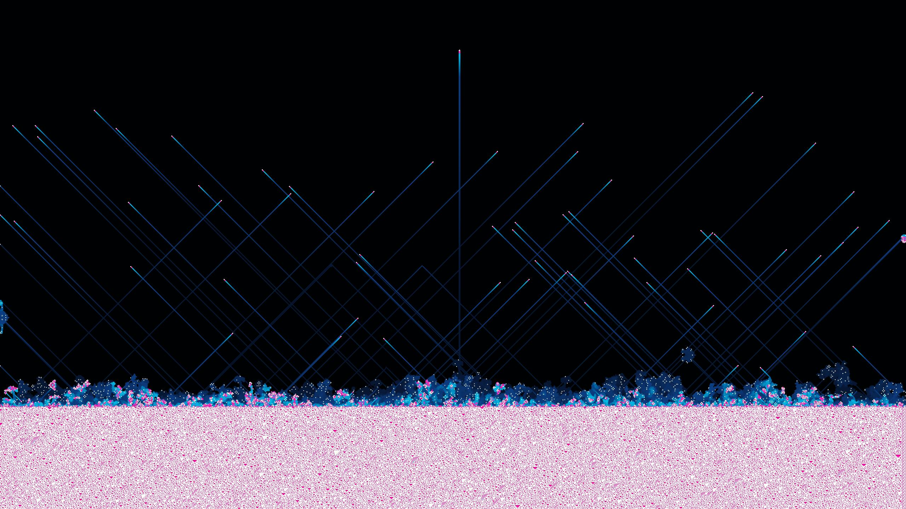

# DX12 Game of Life
康威生命游戏的DX12实现，复刻自[Rule 30 and Game of Life](https://github.com/elliotwaite/rule-30-and-game-of-life)。

使用规则自动生成一维元胞自动机并作为上面二维元胞自动机的输入，可以修改规则以获得不同的效果，如下图所示。

## rule-30

## rule-45

## 键盘快捷键
|按键|功能|
|--|--|
|Alt+Enter|进入/退出全屏|
|Space|启用/关闭垂直同步|
|Esc|退出应用|
## THANKS
[D3D12HelloTexture](https://github.com/microsoft/DirectX-Graphics-Samples/tree/master/Samples/Desktop/D3D12HelloWorld/src/HelloTexture)

[SimpleComputePC12](https://github.com/microsoft/Xbox-ATG-Samples/tree/main/PCSamples/IntroGraphics/SimpleComputePC12)
## LICENSE
[MIT](LICENSE)
